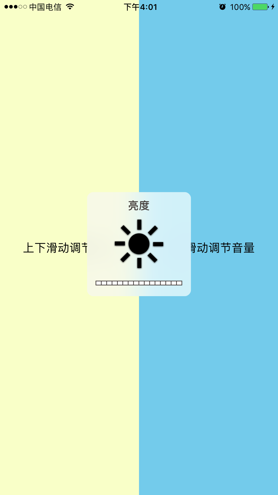

### 代码示例

```
	// 使用方法一 xib使用 拖一个UIView修改继承类为BrightnessVolumeView就可以了
    
    // 使用方法二 全代码使用
    BrightnessVolumeView *brightnessVolumeView = [[BrightnessVolumeView alloc] initWithFrame:self.view.bounds];
    [self.view addSubview:brightnessVolumeView];

```
	
### 图片示例：




[完整代码下载](https://github.com/YiQieSuiYuan/Demo/tree/master/BrightnessVolumeView)

### 参考
[http://www.jianshu.com/p/fd754f7e847b](http://www.jianshu.com/p/fd754f7e847b)

